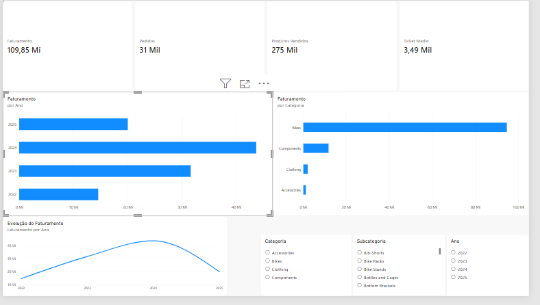

# AdventureWorks Sales Analytics

### SQL Server · Power BI · DAX · Business Intelligence

> Transformando dados transacionais em informações para análise de desempenho comercial.

Este projeto apresenta uma análise completa de vendas utilizando a base **AdventureWorks**, desde a exploração e preparação dos dados no **SQL Server** até a construção de um **dashboard interativo no Power BI**.

O objetivo foi transformar uma grande quantidade de registros de vendas em indicadores que permitam entender **faturamento, pedidos, produtos, categorias e evolução das vendas ao longo do tempo**.

---

## Dashboard

<p align="center">
  
</p>

---

## Visão geral

| Indicador             |                   Resultado |
| --------------------- | --------------------------: |
| Faturamento analisado |       **R$ 109,85 milhões** |
| Pedidos               |                  **31.465** |
| Linhas de vendas      |                 **121.317** |
| Período analisado     | **30/05/2022 → 29/06/2025** |

> Os dados de 2025 são parciais e possuem registros somente até 29/06/2025.

---

# Sobre o projeto

O projeto simula um cenário de **Business Intelligence para análise comercial**.

A partir dos dados relacionais da AdventureWorks, foram construídas consultas SQL para explorar as informações e entender os relacionamentos entre pedidos, produtos, categorias e subcategorias.

Depois dessa etapa, foi criada uma **VIEW consolidada** para servir como fonte de dados do Power BI.

O processo foi estruturado da seguinte forma:

```text
                    ADVENTUREWORKS
                          │
                          ▼
                    SQL SERVER
                          │
              ┌───────────┴───────────┐
              │                       │
         Exploração                JOINs
              │                       │
              └───────────┬───────────┘
                          ▼
                 vw_VendasPowerBI
                          │
                          ▼
                       POWER BI
                          │
                 ┌────────┴────────┐
                 │                 │
                DAX          Visualizações
                 │                 │
                 └────────┬────────┘
                          ▼
                  SALES DASHBOARD
```

---

# Perguntas de negócio

O dashboard foi desenvolvido para responder perguntas como:

**Desempenho**

* Quanto foi faturado?
* Quantos pedidos foram realizados?
* Qual é o ticket médio?
* Como as vendas evoluíram ao longo do tempo?

**Produtos**

* Quais produtos geram mais receita?
* Quais produtos possuem maior volume de vendas?
* Quais categorias concentram o faturamento?

**Análise temporal**

* Como o faturamento se comporta ao longo dos anos?
* Qual foi o crescimento em relação ao período anterior?
* Como interpretar o desempenho de 2025 considerando que o período está incompleto?

---

# Stack

### Dados

**SQL Server**

Utilizado para:

* exploração da base;
* consultas analíticas;
* relacionamentos entre tabelas;
* agregações;
* criação da VIEW utilizada pelo Power BI.

### Business Intelligence

**Power BI**

Utilizado para:

* conexão com o SQL Server;
* tratamento e organização dos dados;
* criação dos indicadores;
* desenvolvimento do dashboard;
* criação de filtros e visualizações interativas.

### Linguagem

**DAX**

Utilizado para criação das principais métricas e análises de desempenho.

### Versionamento

**Git + GitHub**

Utilizados para documentação e versionamento do projeto.

---

# Estrutura dos dados

As principais tabelas utilizadas na construção da análise foram:

```text
Sales.SalesOrderHeader
        │
        │ SalesOrderID
        ▼
Sales.SalesOrderDetail
        │
        │ ProductID
        ▼
Production.Product
        │
        │ ProductSubcategoryID
        ▼
Production.ProductSubcategory
        │
        │ ProductCategoryID
        ▼
Production.ProductCategory
```

Essa estrutura permite relacionar:

**Pedido → Item vendido → Produto → Subcategoria → Categoria**

Dessa forma, é possível analisar o faturamento em diferentes níveis de detalhe.

---

# Preparação dos dados

Para facilitar o consumo pelo Power BI, foi criada a VIEW:

```sql
CREATE VIEW vw_VendasPowerBI AS

SELECT
    h.SalesOrderID AS Pedido,
    h.OrderDate AS DataPedido,

    p.ProductID AS ProdutoID,
    p.Name AS Produto,

    ps.Name AS Subcategoria,
    pc.Name AS Categoria,

    d.OrderQty AS Quantidade,
    d.UnitPrice AS PrecoUnitario,
    d.LineTotal AS Receita

FROM Sales.SalesOrderHeader h

INNER JOIN Sales.SalesOrderDetail d
    ON h.SalesOrderID = d.SalesOrderID

INNER JOIN Production.Product p
    ON d.ProductID = p.ProductID

INNER JOIN Production.ProductSubcategory ps
    ON p.ProductSubcategoryID = ps.ProductSubcategoryID

INNER JOIN Production.ProductCategory pc
    ON ps.ProductCategoryID = pc.ProductCategoryID;
```

A VIEW reúne as informações necessárias para realizar as análises sem precisar reconstruir os relacionamentos diretamente no Power BI.

---

# Indicadores

Foram desenvolvidas medidas DAX para transformar os dados em indicadores de negócio.

### Faturamento

```DAX
Faturamento =
SUM(vw_VendasPowerBI[Receita])
```

### Pedidos

```DAX
Pedidos =
DISTINCTCOUNT(vw_VendasPowerBI[Pedido])
```

### Produtos vendidos

```DAX
Produtos Vendidos =
SUM(vw_VendasPowerBI[Quantidade])
```

### Preço médio

```DAX
Preco Medio =
AVERAGE(vw_VendasPowerBI[PrecoUnitario])
```

### Ticket médio

```DAX
Ticket Medio =
DIVIDE(
    [Faturamento],
    [Pedidos]
)
```

### Crescimento

```DAX
Crescimento % =
VAR Atual = [Faturamento]
VAR Anterior = [Faturamento Periodo Anterior]

RETURN
    IF(
        ISBLANK(Anterior),
        BLANK(),
        DIVIDE(
            Atual - Anterior,
            Anterior
        )
    )
```

---

# Análises do dashboard

## Evolução do faturamento

Acompanhamento do faturamento ao longo do período disponível, permitindo identificar períodos de maior e menor desempenho.

## Faturamento por categoria

A análise demonstra uma forte concentração da receita na categoria **Bikes**.

| Categoria   |         Receita |
| ----------- | --------------: |
| Bikes       | **R$ 94,65 mi** |
| Components  | **R$ 11,80 mi** |
| Clothing    |  **R$ 2,12 mi** |
| Accessories |  **R$ 1,27 mi** |

## Produtos

Foi desenvolvido um ranking dos produtos com maior faturamento, permitindo identificar os itens que possuem maior contribuição para a receita.

Entre os destaques estão diferentes versões da linha **Mountain-200**, que aparecem entre os produtos de maior faturamento.

---

# Principais insights

A análise dos dados permite observar alguns pontos importantes:

### 01 — Forte concentração em Bikes

A categoria Bikes representa a maior parte do faturamento analisado, apresentando uma participação significativamente superior às demais categorias.

### 02 — Mountain-200 se destaca

Produtos da linha Mountain-200 aparecem entre os maiores geradores de receita, indicando forte desempenho dessa linha dentro da base analisada.

### 03 — Crescimento ao longo dos anos

O faturamento apresenta evolução significativa entre os primeiros anos disponíveis na base.

### 04 — Cuidado com 2025

O ano de 2025 não representa um ano completo. A base possui dados somente até **29/06/2025**, portanto comparações anuais precisam considerar o período equivalente.

Esse cuidado evita interpretar incorretamente uma queda aparente causada simplesmente pela diferença na quantidade de meses disponíveis.

---

# O que foi desenvolvido

```text
[x] Exploração da base AdventureWorks
[x] Identificação dos relacionamentos
[x] Consultas SQL
[x] JOIN entre tabelas
[x] Agregações e análises
[x] Criação da VIEW vw_VendasPowerBI
[x] Conexão SQL Server → Power BI
[x] Criação de medidas DAX
[x] Indicadores de desempenho
[x] Análise temporal
[x] Ranking de produtos
[x] Análise por categoria
[x] Filtros interativos
[x] Dashboard executivo
[x] Documentação
```

---

# Estrutura do repositório

```text
AdventureWorks-SQL-PowerBI/
│
├── README.md
│
├── SQL/
│   └── consultas.sql
│
├── PowerBI/
│   └── AdventureWorks-Sales.pbix
│
└── imagens/
    └── dashboard.png
```

---

# Como executar

### 1. SQL Server

Restaurar a base **AdventureWorks** em uma instância do SQL Server.

### 2. Scripts SQL

Executar os arquivos disponíveis na pasta:

```text
SQL/
```

### 3. Power BI

Abrir:

```text
PowerBI/AdventureWorks-Sales.pbix
```

Configurar a conexão com o SQL Server utilizado e atualizar os dados.

---

# Aprendizados

Este projeto foi desenvolvido também como uma aplicação prática de conceitos de **SQL, Business Intelligence e análise de dados**.

Durante o desenvolvimento foram trabalhados:

* SQL Server;
* SELECT e filtros;
* INNER JOIN;
* relacionamentos entre tabelas;
* aliases;
* GROUP BY;
* ORDER BY;
* funções de agregação;
* criação de VIEW;
* análise temporal;
* Power BI;
* DAX;
* indicadores de desempenho;
* visualização de dados;
* interpretação de métricas;
* construção de dashboard;
* documentação de projeto.

---

# Próximos passos

Algumas melhorias planejadas para futuras versões:

* análise detalhada de clientes;
* análise de participação percentual;
* indicadores adicionais de desempenho;
* análise de margem;
* comparação de períodos equivalentes;
* expansão do dashboard para novas áreas de negócio.

---

# Autor

## Igor Gabriel da Silva

Estudante de **Análise e Desenvolvimento de Sistemas**, com foco em desenvolvimento, SQL, dados, Power BI e tecnologia.

<p align="left">
  <a href="https://github.com/igor488">
    
  </a>
</p>

---

### Projeto desenvolvido para fins de estudo, portfólio e aplicação prática de conceitos de SQL, Business Intelligence e análise de dados.
